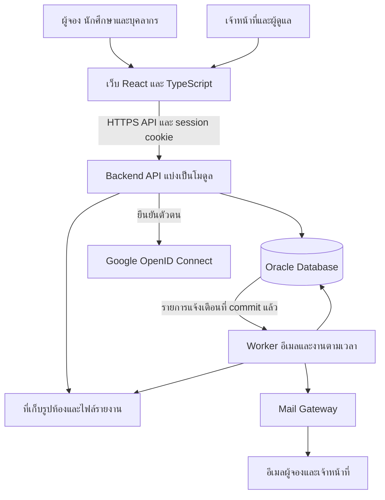
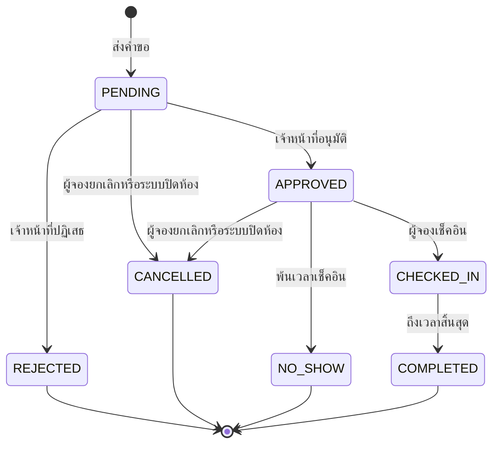

# โครงสร้างระบบจองห้องเรียนและห้องประชุม

วันที่ออกแบบ 8 ตุลาคม 2569

## 1 ข้อเสนอหลัก

ใช้ **Modular Monolith** คือระบบหลังบ้านชุดเดียวที่แบ่งงานตามหน้าที่ เชื่อมกับเว็บสำหรับผู้จองและเจ้าหน้าที่ ใช้ Oracle ตามฐานข้อมูลที่มีอยู่ และแยก process สำหรับงานอัตโนมัติออกจาก process ที่รับคำขอเว็บ ทั้งสองใช้โมดูลธุรกิจและฐานข้อมูลชุดเดียวกัน

โครงสร้างนี้เหมาะกับโปรเจคของทีม 7 คน เพราะแบ่งพัฒนาเป็นส่วนได้ แต่การจอง ห้อง อุปกรณ์ ประวัติ และรายการแจ้งเตือนยังบันทึกใน transaction เดียวกันได้ ไม่ต้องสร้างระบบสื่อสารระหว่างหลายบริการตั้งแต่ต้น

เอกสารนี้เป็นแบบสำหรับเริ่มพัฒนา ยังไม่ได้สร้างแอปหรือเชื่อมต่อฐานข้อมูลจริง ข้อกำหนดจากเอกสารเดิมและข้อเสนอเพิ่มเติมแยกไว้ในหัวข้อ 12 ส่วนข้อสังเกตของสคริปต์เดิมอยู่ใน [DATABASE_REVIEW.md](DATABASE_REVIEW.md)

## 2 ขอบเขตและหลักฐานที่ใช้

ระบบให้บริการห้องเรียนและห้องประชุมในอาคารมหาวิทยาลัย ยกเว้นหอพัก ครอบคลุมการเข้าใช้ผ่าน Google การค้นหา จอง อนุมัติ ยกเลิก เช็คอิน การจัดการสถานที่ อุปกรณ์ การแจ้งเตือน FAQ บทลงโทษ และรายงาน

| ไฟล์ต้นทาง | ข้อมูลที่ใช้ในการออกแบบ |
| --- | --- |
| [ASS-01-02-doc.docx](../Request/ASS-01-02-doc.docx) | ภาพรวม ขอบเขต BR1–BR13 และรายการ Use Case หลัก |
| [ASS02-02-Draft.docx](../Request/ASS02-02-Draft.docx) | Scenario รายละเอียดฟอร์ม ผู้เข้าร่วม อุปกรณ์ FAQ การปิดห้องและต้นแบบหน้าจอ |
| [ASS03-02-Document.docx](../Request/ASS03-02-Document.docx) | Activity และ System Sequence Diagram ของกระบวนการ |
| [SA04.docx](../Request/SA04.docx) | Class และ Sequence Diagram สำหรับเทียบการแบ่งหน้าที่ |
| [SAfordata.ddl](../Request/SAfordata.ddl) | Oracle DDL เดิม 18 ตาราง ความสัมพันธ์ และ index |
| [SAfordata_claude.sql](../Request/SAfordata_claude.sql) | ข้อเสนอเพิ่ม constraint สต็อก NO_SHOW และ trigger ป้องกันจองซ้อน |
| [Term Project_เบส_888.pdf](../Request/Term%20Project_เบส_888.pdf) | ERD และตัวอย่าง transaction การจองพร้อมอุปกรณ์และการอนุมัติ |
| [ปรับปรุงแก้ไขdatabase.pdf](../Request/ปรับปรุงแก้ไขdatabase.pdf) | ปัญหาและเหตุผลการปรับฐานข้อมูล เทียบกับ DDL |

เลข Use Case บางส่วนไม่ตรงกัน เช่น การยกเลิกถูกเรียก UC1 ในรายการรวม แต่เป็น UC5 ในบาง Scenario/Diagram เอกสารนี้ใช้เลขจากรายการรวมใน ASS-01-02-doc และกำกับชื่อการทำงานเสมอ ไม่ถือว่าเลขต่างกันหมายถึงฟังก์ชันใหม่

เอกสารภาพรวมระบุว่าตัด IoT ออกจากขอบเขต แต่บางภาคผนวกและรายงานฐานข้อมูลยังกล่าวถึงการตัดไฟและ PowerLog แบบนี้จึงไม่รวม IoT หรือรายงานพลังงานในรุ่นแรก

## 3 ภาพรวมการทำงาน



เว็บเรียก API เท่านั้น การตัดสินสิทธิ์และกฎการจองอยู่ที่ระบบหลังบ้าน Oracle เป็นแหล่งข้อมูลจริงเรื่องช่วงเวลาและสถานะ ผลค้นหาว่างเป็นข้อมูล ณ เวลาค้นหา และต้องตรวจซ้ำเมื่อบันทึก

## 4 เทคโนโลยีที่เสนอ

| ส่วน | เทคโนโลยี | เหตุผล |
| --- | --- | --- |
| เว็บ | React + TypeScript + Vite | เหมาะกับฟอร์ม ปฏิทิน ตาราง และต้นแบบหน้าจอที่มีอยู่ |
| API | Node.js + NestJS + TypeScript | แบ่งโมดูล Controller Service Repository และตรวจสิทธิ์ได้เป็นระบบ |
| Database | Oracle + node-oracledb | ใช้ SQL/PLSQL และแบบข้อมูลเดิมได้โดยตรง |
| Login | Google OpenID Connect | สอดคล้องกับ Sign in with Google และข้อจำกัดบัญชีมหาวิทยาลัย |
| Session | session ฝั่ง server และ HttpOnly cookie | ตรวจบัญชีและสิทธิ์ล่าสุดทุกคำขอที่สำคัญ |
| อีเมล | Mail Gateway/SMTP ที่ทีมได้รับอนุญาตให้ใช้ | ไม่ต้องขอสิทธิ์เข้าถึงกล่องจดหมายผู้ใช้เพื่อส่งแจ้งเตือน |
| งานอัตโนมัติ | Worker จาก codebase เดียวกัน + ตารางงานใน Oracle | งานไม่สูญหายเมื่อ restart และไม่ต้องเพิ่ม Redis ในรุ่นแรก |
| รูปและรายงาน | private storage สำหรับรายงาน และที่เก็บรูปที่สำรองได้ | เก็บ metadata/สิทธิ์ใน DB และเก็บเนื้อไฟล์แยก |
| เอกสาร API | OpenAPI | ให้คนทำเว็บและ backend ใช้รูปแบบข้อมูลเดียวกัน |

นี่เป็นข้อเสนอสำหรับโปรเจคนี้ ไม่ใช่เทคโนโลยีที่พบว่าติดตั้งแล้ว ปัจจุบัน repository มี README เอกสาร และโฟลเดอร์โปรเจค แต่ยังไม่มีโค้ดแอป

Vite มี template React/TypeScript และ NestJS รองรับ feature modules ตามเอกสารทางการ: [Vite](https://vite.dev/guide/), [NestJS Modules](https://docs.nestjs.com/modules)

DDL ระบุ Oracle 12c ส่วนสคริปต์แก้ระบุอย่างน้อย 12.1.0.2 ต้องตรวจเวอร์ชัน server จริงก่อนเลือก driver mode: node-oracledb Thin ต้องใช้ Oracle 12.1 ขึ้นไป ส่วน Thick ต้องตรวจความเข้ากันได้ของ Oracle Client อีกครั้ง ไม่ถือว่า header ใน DDL ยืนยันระบบที่ใช้งานจริงแล้ว [เอกสารติดตั้ง driver](https://node-oracledb.readthedocs.io/en/stable/user_guide/installation.html)

## 5 บทบาทและสิทธิ์

แยกประเภทบุคคล เช่น STUDENT/TEACHER ออกจากสิทธิ์บริหารระบบ ใน API ใช้ permission role `USER`, `STAFF`, `ADMIN` และตรวจขอบเขตห้องเพิ่มเติม ไม่อนุมานสิทธิ์เจ้าหน้าที่จากโดเมนหรือค่าที่เว็บส่งมา

| การทำงาน | USER | STAFF | ADMIN |
| --- | --- | --- | --- |
| ค้นหา จอง และดูประวัติของตน | ได้ | ได้ในฐานะผู้จอง | ได้ในฐานะผู้จอง |
| ยกเลิกและเช็คอิน | เฉพาะของตน | เฉพาะของตน | เฉพาะของตน การจัดการแทนใช้คำสั่ง admin แยก |
| อนุมัติหรือปฏิเสธ | ไม่ได้ | เฉพาะห้องที่มอบหมายและช่วงมอบหมายยังมีผล | ทุกห้อง โดยบันทึกว่าใช้สิทธิ์ admin |
| ตรวจความพร้อมห้องและอุปกรณ์ | ไม่ได้ | เฉพาะห้องที่มอบหมาย | ทุกห้อง |
| ปิดห้องชั่วคราว | ไม่ได้ | ไม่ได้เป็นค่าเริ่มต้น | ได้ |
| อาคาร ชั้น ประเภทห้อง วันหยุด และสิทธิ์ | ไม่ได้ | อ่านเท่าที่จำเป็น | จัดการได้ |
| พิจารณาบทลงโทษ | ดูสถานะของตน | ไม่ได้เป็นค่าเริ่มต้น | ได้ |
| รายงาน | ดูข้อมูลการจองของตน | เฉพาะขอบเขตที่ดูแล | ภาพรวม |
| FAQ และประวัติสนทนา | อ่าน FAQ และแชทของตน | อ่าน FAQ | จัดการ FAQ และเข้าถึงประวัติตามสิทธิ์งานช่วยเหลือ |

การแบ่ง STAFF/ADMIN และ admin override เป็นข้อเสนอ ต้องปรับ trigger เดิมให้รองรับตรงกันก่อนเปิดใช้งาน การตรวจสิทธิ์ต้องอยู่ใน API แม้เว็บซ่อนปุ่มไว้แล้ว

## 6 โมดูลและเจ้าของข้อมูล

| โมดูล | หน้าที่และตารางที่รับผิดชอบ | Use Case |
| --- | --- | --- |
| Auth / Users | Google callback, session, profile, role; users, staff, affiliation และ identity/session ที่เพิ่ม | UC2 UC3 |
| Locations | อาคาร ชั้น ประเภทห้อง และวันหยุด; building, floor, room_type, holiday | UC10 และกฎวันหยุด |
| Rooms | รายละเอียดห้อง อุปกรณ์ประจำห้อง ผู้ดูแล ช่วงปิด และบันทึกตรวจสภาพ; room, room_equipment, room_assignment | UC9 UC14 |
| Availability | ค้นหาและคำนวณห้องว่าง โดยอ่าน Rooms และ Bookings | UC4 |
| Bookings | สร้างคำขอ ประวัติ อนุมัติ ยกเลิก เช็คอิน และ state transition; booking, booking_participant | UC1 UC5 UC6 UC8 UC15 |
| Equipment | สต็อกและรายการยืม; equipment, booking_equipment และ stock movement ที่เสนอเพิ่ม | ส่วนอุปกรณ์ของ UC5 UC9 |
| Notifications | แม่แบบ รายการส่ง สถานะส่งซ้ำ; notification | UC11 UC13 |
| Penalties | ประวัติผิดเงื่อนไข คิวพิจารณา ตักเตือน ระงับสิทธิ์; penalty และ violation ที่เสนอเพิ่ม | UC16 |
| Reports | สถิติและ snapshot การส่งออก; report และ report detail ที่จำเป็น | UC12 |
| Help | tutorial, FAQ, ค้นหาคำตอบ และประวัติแชท | UC7 |
| Audit | ประวัติการเปลี่ยนแปลง; booking_log และ audit_event ที่เสนอเพิ่ม | ทุกคำสั่งสำคัญ |
| Jobs | ส่งอีเมล ตรวจ no-show ปิดรอบ แจ้งคำขอเกิน SLA | กระบวนการอัตโนมัติ |

Approval และ Check-in เป็นส่วนของ Bookings เพื่อใช้กติกาสถานะเดียวกัน ส่วน UC13 ใช้ Notifications ร่วมกับ UC11 ไม่สร้างระบบอีเมลอีกชุด

แนวทางภายในแต่ละโมดูล: `Controller → Service → Repository → Oracle` Controller แปลง request และตรวจ input; Service ตรวจสิทธิ์และกฎธุรกิจ; Repository รับ connection ของ transaction เดิมและอ่าน/เขียน SQL ห้ามเปิด connection ใหม่กลาง transaction

Availability อ่านข้อมูลได้ แต่ไม่ถือสิทธิ์บันทึกการจอง Jobs เรียก service เดียวกับ API และ Audit/Notifications รับรายการเขียนใน transaction เดียวกันเพื่อลดโค้ดกฎธุรกิจที่ซ้ำกัน

## 7 โครงสร้างโฟลเดอร์ที่เสนอ

```text
Web app/
├── Request/                         เอกสารต้นทาง
├── docs/
│   ├── SYSTEM_ARCHITECTURE.md        แบบระบบฉบับนี้
│   └── DATABASE_REVIEW.md            จุดแก้ไข schema และ SQL
└── Room-Booking-System/              โค้ดแอปในขั้นพัฒนาต่อไป
    ├── apps/
    │   ├── web/src/
    │   │   ├── app/                 routing, layouts และ session
    │   │   ├── features/            rooms, bookings, approvals, penalties,
    │   │   │                        reports, help, profile, administration
    │   │   ├── components/          form, table, status และ dialog ที่ใช้ร่วมกัน
    │   │   └── lib/                 API client และรูปแบบวันเวลา
    │   └── backend/src/
    │       ├── main.ts              entry point ของ API
    │       ├── worker.ts            entry point ของงานอัตโนมัติ
    │       ├── modules/             โมดูลในหัวข้อ 6
    │       ├── common/              errors, guards, validation และ clock
    │       └── infrastructure/      Oracle pool, transactions, mail, storage
    ├── packages/contracts/          API schema, status และ error code
    ├── database/
    │   ├── migrations/              SQL ตามลำดับเวอร์ชัน
    │   ├── seed/                    ข้อมูลสาธิตที่ไม่ใช่ข้อมูลจริง
    │   └── verification/            ตรวจ schema และกรณี concurrency
    ├── tests/                       integration และ end-to-end
    ├── infra/                       ตัวอย่างการรันและตั้งค่าระบบ
    ├── .env.example                 ชื่อตัวแปร ไม่มี secret
    └── README.md                    วิธีติดตั้ง รัน และทดสอบ
```

โครงสร้างด้านล่าง Room-Booking-System เป็นข้อเสนอ ยังไม่ได้ scaffold พบ `.git` ทั้งที่โฟลเดอร์รากและใน Room-Booking-System จึงต้องเลือก repository ที่ทีมจะใช้จริงก่อนตั้ง CI และเพิ่มโค้ด โดยไม่ลบหรือย้าย `.git` อัตโนมัติ

## 8 วงจรชีวิตของการจอง



สถานะที่กันช่วงเวลาห้องไว้ตามข้อเสนอคือ `PENDING`, `APPROVED`, `CHECKED_IN` สถานะจบแล้วไม่เปิดกลับเป็น PENDING; หากต้องการจองใหม่ให้สร้างรายการใหม่และอ้างรายการเดิมได้

`CANCELLED` ต้องมี `cancelled_by`, `cancelled_at`, `cancellation_reason_code` เช่น USER_CANCELLED, ROOM_CLOSED, UNAPPROVED_AT_START เพื่อไม่คิดความผิดให้ผู้ใช้เมื่อระบบหรือผู้ดูแลยกเลิก ส่วน `NO_SHOW` ใช้แสดงเหตุผลที่ต่างจากการยกเลิกทั่วไป

API เปลี่ยนสถานะผ่านคำสั่งเฉพาะ เช่น approve/reject/cancel/check-in ไม่เปิด endpoint ให้ client ส่งสถานะใดก็ได้ การกดซ้ำหรือ worker ทำงานซ้ำต้องไม่สร้าง log ความผิด หรือคืนสต็อกซ้ำ

## 9 กฎธุรกิจและจุดตรวจ

| กฎจากต้นทาง | จุดตรวจในแบบระบบ |
| --- | --- |
| BR1 ต้อง login ก่อนจอง | SessionGuard ใน API และตรวจ account status ก่อน command |
| BR2 จองล่วงหน้าไม่เกิน 15 วัน | BookingPolicy ตรวจวันที่ตาม Asia/Bangkok ด้วยเวลาฝั่ง server |
| BR3 ครั้งละ 30 นาทีถึง 4 ชั่วโมง | ตรวจผลต่าง start/end ใน service และ DB constraint |
| BR4 ห้ามจองห้องเดียวกันซ้อน | ล็อกแถว room และ query overlap ภายใน transaction |
| BR5 ยกเลิกก่อนเริ่มอย่างน้อย 2 ชั่วโมง | service ตรวจอีกครั้งขณะยืนยัน ไม่เชื่อผลจากปุ่มบนเว็บ |
| BR5 ส่วนวันหยุด | ตรวจ holiday และปฏิเสธการจองวันหยุด; แยก error จากยกเลิกช้า |
| BR6 แจ้งผลอนุมัติหรือปฏิเสธ | บันทึก notification ใน transaction แล้ว worker ส่งหลัง commit |
| BR7 พิจารณาภายใน 4 ชั่วโมง | approval_due_at, คิวเรียงตาม deadline และ job แจ้งผู้รับผิดชอบ |
| BR8 PENDING สูงสุด 3 คำขอต่อคน | ล็อก users ก่อนนับและเพิ่มคำขอ เพื่อกันส่งพร้อมกันคนละห้อง |
| BR9 ปิดห้องและแจ้งผู้ได้รับผลกระทบ | room_closure และยกเลิก booking ที่ได้รับผลกระทบใน transaction |
| BR10 บัญชีมหาวิทยาลัยเท่านั้น | ตรวจ Google token ฝั่ง server และ allowlist โดเมนที่มหาวิทยาลัยยืนยัน |
| BR11 ตรวจสภาพเมื่อสิ้นวันทำการ | แบบฟอร์ม inspection พร้อมวันที่ ผู้ตรวจ และสภาพอุปกรณ์ย้อนหลัง |
| BR12 ผิดเงื่อนไขตั้งแต่ 3 ครั้งส่งพิจารณา | violation ที่ deduplicate แล้ว + จุดเริ่มนับหลังการตัดสินครั้งล่าสุด |
| BR13 เช็คอินภายใน 30 นาที | CheckInPolicy และ worker no-show ใช้กติกาเวลาเดียวกัน |

ใช้ช่วงเวลาแบบ `[start, end)` คือรวมเวลาเริ่มแต่ไม่รวมเวลาสิ้นสุด การจอง 09:00–10:00 และ 10:00–11:00 จึงไม่ซ้อน สูตรตรวจคือ `existing.start < requested.end AND existing.end > requested.start`

API รับและส่ง ISO 8601 ที่ระบุ offset เช่น `2026-10-10T09:00:00+07:00` ฐานข้อมูลใหม่ควรใช้ TIMESTAMP WITH TIME ZONE อย่างสม่ำเสมอ หากคง TIMESTAMP เดิม ต้องแปลงเป็นเวลา Bangkok ก่อน bind และกำหนด session timezone ให้ตรงกัน ห้ามนำค่าไม่มี timezone ไปตีความเป็น UTC โดยอัตโนมัติ

## 10 กระบวนการสำคัญและ transaction

### 10.1 ส่งคำขอจอง

1. ตรวจ session และ input; user ID มาจาก session ไม่รับผู้จองจาก client
2. เริ่ม transaction และล็อก users ของผู้จอง ตรวจบัญชี บทลงโทษ และจำนวน PENDING
3. ล็อก room ตรวจสถานะ soft delete ความจุ วันหยุด ช่วงปิด และกฎเวลา
4. ตรวจช่วงซ้อนกับสถานะที่กันเวลาไว้ ล็อก equipment ตาม ID จากน้อยไปมากและตรวจสต็อก
5. เพิ่ม booking สถานะ PENDING พร้อม expected_attendees, ผู้เข้าร่วมและอุปกรณ์
6. เพิ่ม booking_log และ notification ของผู้จอง/เจ้าหน้าที่ รวมทั้ง idempotency record
7. commit แล้วส่งผลสำเร็จ; หากขั้นใดล้มเหลว rollback ทั้งชุด

สำหรับทุก command ให้ใช้ลำดับล็อกเดียวกัน: users ที่เกี่ยวข้องเรียง ID → room เรียง ID → booking เรียง ID → equipment เรียง ID ล็อกเฉพาะสิ่งที่จำเป็น หากต้องอ่านเพื่อหา ID ก่อนล็อก ให้ตรวจข้อมูลนั้นซ้ำหลังได้ lock ห้ามมี command หนึ่งล็อก booking ก่อน room ขณะที่อีก command ทำกลับกัน

ใช้ connection เดียวและ explicit commit/rollback; SQL bind parameters ทุกค่า ห้าม commit ภายใน repository หรือ procedure ย่อย การจัด transaction นี้อิงความสามารถ driver ที่เอกสารระบุ [node-oracledb Transactions](https://node-oracledb.readthedocs.io/en/stable/user_guide/txn_management.html)

### 10.2 อนุมัติหรือปฏิเสธ

ตรวจ STAFF พร้อม room_assignment หรือ ADMIN ที่มี permission จากนั้นล็อกทรัพยากรและ booking ตามลำดับ ตรวจว่าเป็น PENDING และยังไม่เริ่มใช้งาน ตรวจช่วงปิดห้อง/ความว่างอีกครั้ง แล้วเปลี่ยนสถานะ บันทึกผู้ตัดสิน เวลา และเหตุผลกรณีปฏิเสธ พร้อม log และ notification ใน transaction เดียว

การอนุมัติที่ชนกับการยกเลิกต้องสำเร็จได้เพียงการเปลี่ยนสถานะเดียว อีกคำสั่งตอบ conflict พร้อมสถานะล่าสุด ไม่เขียนทับผลเดิม

### 10.3 ยกเลิกและเช็คอิน

ผู้จองยกเลิกได้เฉพาะของตนที่เป็น PENDING/APPROVED และเหลืออย่างน้อย 2 ชั่วโมง สำเร็จแล้วปล่อย reservation ห้อง/อุปกรณ์ บันทึกเหตุผลและ queue อีเมล หากช้าเกินกฎ ให้คงสถานะเดิม บันทึกเหตุการณ์ผิดเงื่อนไขเพียงครั้งต่อ booking และประเภทเหตุการณ์ แล้ว commit log ก่อนตอบ error ตามกฎ ห้าม rollback log นั้นไปพร้อมข้อผิดพลาดธุรกิจ

ผู้จองเช็คอินได้เฉพาะ APPROVED ของตน เมื่อ `start <= now <= start + 30 นาที` และ `now < end` และยังไม่มี actual_checkin_time ตรวจบัญชีและบทลงโทษที่มีผลตาม Scenario UC15 บันทึกเวลาและเปลี่ยน CHECKED_IN ใน transaction เดียว

กรณีการจองยาว 30 นาที เวลา `start + 30 นาที` คือเวลาสิ้นสุดแล้ว จึงใช้เงื่อนไข `now < end` ป้องกันเช็คอินหลังหมดรอบ เป็นข้อเสนอที่ต้องยืนยันในหัวข้อ 12

### 10.4 ปิดห้องชั่วคราว

หน้า admin แสดงจำนวนและรายการผู้ได้รับผลกระทบก่อนยืนยัน Service ล็อก room บันทึก room_closure พร้อมช่วงเวลาและเหตุผล ยกเลิก PENDING/APPROVED ที่ซ้อนช่วงปิดด้วยเหตุผล ROOM_CLOSED ปล่อย reservation และเขียน log/notification โดยไม่เพิ่มความผิดแก่ผู้จอง

การปิดช่วงเวลาในอนาคตไม่ทำให้ห้องปิดทั้งวันหรือทั้งเดือน สถานะที่หน้าเว็บแสดงต้องคำนวณจากช่วงที่ค้นหา หากมี CHECKED_IN อยู่ในช่วงปิด ให้แสดงรายการและบังคับผู้ดูแลเลือกวิธีจัดการก่อนยืนยัน ไม่เปลี่ยนสถานะผู้ใช้ที่กำลังใช้งานอย่างเงียบ ๆ

### 10.5 อุปกรณ์

แยกอุปกรณ์ประจำห้องจากกองกลางที่ยืมได้ ตัวเลข total_qty/remaining_qty สำหรับการจองต้องหมายถึงกองที่ยืมได้เท่านั้น อุปกรณ์ประจำห้องอยู่ใน room_equipment และไม่ตัดกองกลางซ้ำ

รุ่นแรกเสนอใช้การกันจำนวนทันทีตั้งแต่ PENDING ตามสคริปต์ที่มีอยู่ วิธีนี้ง่ายแต่คำขอในคนละวันก็แย่งโควตาอุปกรณ์เดียวกัน จึงต้องแสดงข้อจำกัดนี้ให้ทีมรับทราบ หากต้องการใช้กองกลางซ้ำตามช่วงเวลา ให้เปลี่ยนเป็น reservation ตามช่วงเวลาและตรวจความจุพร้อมกันก่อนเริ่มพัฒนาโมดูลนี้

ต้องแยกการคืน reservation ออกจากการคืนของจริง เพิ่มสถานะ RESERVED/ISSUED/RETURNED/RELEASED ในรายการยืมและ stock_movement: REJECTED/CANCELLED/NO_SHOW คืนโควตาได้เมื่อยังไม่จ่ายของ; COMPLETED คืนได้เมื่อไม่มีของค้างหรือมีการบันทึกคืนแล้ว ของที่ยังไม่ได้คืนต้องคงยอดค้างและแจ้งเจ้าหน้าที่ สคริปต์ที่คืนจำนวนทันทีเมื่อ COMPLETED จึงต้องปรับก่อนนำมาใช้กับการยืมจริง

## 11 งานอัตโนมัติและความน่าเชื่อถือ

งานตามเวลาทั้งหมดอ่านเวลาปัจจุบันจากระบบที่เชื่อถือได้และบันทึกสถานะงานลง DB ไม่ใช้ตัวนับถอยหลังบนเว็บเป็นผู้เปลี่ยนสถานะ

| งาน | รอบที่เสนอ | พฤติกรรม |
| --- | --- | --- |
| ส่งอีเมล | อ่าน queue ทุก 10–30 วินาที | ส่งหลัง commit, retry แบบเพิ่มระยะรอ และแสดงงานที่ล้มเหลวให้ admin |
| ตรวจ no-show | ทุก 1 นาที | APPROVED ที่ไม่เช็คอินและพ้น grace/end → NO_SHOW + violation + notification |
| ปิดรอบใช้งาน | ทุก 1 นาที | CHECKED_IN ที่ถึง end → COMPLETED; ไม่ยืนยันว่าของคืนแล้วจากเวลาอย่างเดียว |
| คำขอใกล้/เกิน 4 ชั่วโมง | ทุก 1 นาที | แจ้งเจ้าหน้าที่และ admin พร้อมป้าย SLA เกิน ไม่ auto-approve |
| PENDING ถึงเวลาเริ่ม | ทุก 1 นาที | ข้อเสนอ: CANCELLED เหตุผล UNAPPROVED_AT_START ปล่อยทรัพยากรและแจ้งผู้จอง ไม่ลงความผิด |
| บทลงโทษหมดอายุ | ทุกวัน และตรวจจริงทุก command | แสดง EXPIRED; การบังคับสิทธิ์ยึดช่วงวันที่จริงแม้ job ยังไม่ทำงาน |
| ตรวจสภาพสิ้นวัน | ตามเวลาปิดที่ตั้งค่า | เตือนผู้รับผิดชอบกรอก inspection ไม่สร้างผลตรวจแทนคน |

รอบ job เป็นข้อเสนอทางเทคนิค ไม่ใช่กฎจากเอกสาร ผล no-show อาจแสดงช้ากว่ากำหนดไม่เกินรอบตรวจในภาวะปกติ API เช็ค deadline ทุกครั้งแม้ worker หยุด และหลัง restart ต้องเก็บตกงานจาก DB

ใช้ notification เป็น transactional outbox เพิ่ม delivery_status, attempt_count, next_attempt_at, locked_until, sent_at, last_error และ deduplication_key แยกช่อง channel=EMAIL ออกจาก noti_type=BOOKING_APPROVED เป็นต้น การบันทึกคิวไม่ได้แปลว่าส่งถึง inbox สำเร็จ

worker claim งานด้วย row lock/lease ป้องกันสอง instance ทำงานเดียวกัน งานค้าง SENDING ที่ lease หมดต้องคืนมาส่งได้ การบันทึกผลสถานะ booking และ violation ใช้ conditional update/unique key เพื่อทำซ้ำได้อย่างปลอดภัย

อีเมลรับประกันการพยายามส่งซ้ำได้ แต่ยังอาจซ้ำหากผู้ให้บริการรับแล้ว process ล้มก่อนบันทึก SENT ใช้ provider idempotency เมื่อรองรับ และไม่อ้างว่าส่ง exactly once หรือเข้าถึง inbox แน่นอน ตัว scheduler อาจใช้ NestJS Schedule แต่ความทนต่อ restart ต้องมาจากข้อมูลและ lock ใน DB [NestJS Scheduling](https://docs.nestjs.com/techniques/task-scheduling)

## 12 ข้อกำหนดที่ต้องตกลงและค่าเริ่มต้นที่เสนอ

หัวข้อนี้ทำให้เริ่มพัฒนาได้ด้วยข้อเสนอชัดเจน แต่ไม่ถือว่าทีมอนุมัติกติกาเพิ่มเติมแล้ว

| ประเด็น | หลักฐาน/ความต่าง | ค่าเริ่มต้นที่เสนอ |
| --- | --- | --- |
| PENDING กันช่วงเวลาไหม | BR4 กล่าวถึงที่อนุมัติ แต่ Scenario มี slot locking และ SQL กัน PENDING ด้วย | กัน PENDING/APPROVED/CHECKED_IN; แสดงรออนุมัติเป็นกันเวลา |
| พ้น 4 ชั่วโมงแล้วทำอย่างไร | BR7 กำหนดเวลาพิจารณา แต่ไม่ได้ระบุการหมดอายุ | แจ้งเกิน SLA และ escalate; ไม่อนุมัติหรือปฏิเสธอัตโนมัติ |
| คำขอยัง PENDING เมื่อถึงเวลาเริ่ม | ยังไม่มีกฎชัด | ยกเลิกโดยระบบโดยไม่คิดความผิด และบันทึกเหตุผล |
| จองได้เร็วสุดเมื่อใด | ไม่กำหนด minimum lead time | ตั้งค่าได้ และเสนออย่างน้อย 4 ชั่วโมงเพื่อให้สอดคล้อง SLA; เป็นกฎเพิ่มที่ต้องยืนยัน |
| จองข้ามวันและนอกเวลาทำการ | รายงานฐานข้อมูลกล่าวถึงข้ามวัน แต่ไม่ระบุเวลาบริการ | รุ่นแรกใช้วันเดียวและเวลาบริการที่ตั้งค่าต่ออาคาร; หากรองรับข้ามวันต้องตรวจทุกวันและทุกช่วงปิด |
| 15 วันนับอย่างไร | BR2 ไม่มีรายละเอียดระดับนาที | นับวันปฏิทิน Bangkok รวมวันที่วันนี้ + 15 วัน โดย start ต้องยังไม่ผ่าน |
| เช็คอินตรงครบ 30 นาที | UC15 ระบุภายใน 30 นาที แต่รอบสั้นสุดก็ 30 นาที | ยอมรับถึงครบ 30 นาทีเฉพาะเมื่อยังไม่ถึง end; รอบ 30 นาทีต้องเช็คอินก่อน end |
| ยกเลิกช้าเพิ่มความผิดเมื่อใด | รายละเอียดกล่าวถึงปฏิเสธและบันทึกความผิด แต่ Scenario ยกเลิกไม่ครบทุกทางแยก | เพิ่มเมื่อผู้ใช้ยืนยันคำขอยกเลิกช้าที่ API ไม่เพิ่มจากการเปิด modal |
| ความผิดซ้ำของ booking เดียว | ไม่ระบุชัด | dedupe ตาม booking + violation type; late cancel และ no-show อาจนับได้อย่างละ 1 ต้องยืนยันความเป็นธรรมก่อนเปิดจริง |
| ระงับสิทธิ์หลังมีการจองแล้ว | UC15 ห้ามเช็คอินขณะระงับ แต่ SQL ตรวจบางจังหวะเท่านั้น | ห้ามจองใหม่/เช็คอินตาม Scenario; การยกเลิกเดิมและ no-show ระหว่างระงับต้องเลือกนโยบายก่อนพัฒนา penalty |
| อีเมลและ hosted domain | มีตัวอย่าง kkumail.com แต่ไม่มี allowlist ที่รับรองครบ | ใช้ configuration ที่เจ้าของระบบยืนยัน ตรวจ claims และ hd ฝั่ง server |
| ประเภทบุคคล/สิทธิ์ | CHECK ใน SQL ระบุ STUDENT/TEACHER/STAFF/ADMIN เป็นค่าที่สมมติ | แยก person_type กับ permission role; สร้าง staff/admin โดยผู้ดูแลเท่านั้น |
| ประวัติ 7/30 วัน | บางเอกสารกล่าวถึงหน้าจอ 7 วัน DB 30 วัน แต่มีรายงานรายปีและการนับความผิด | หน้าแรก default 7 วัน; ไม่ลบข้อมูลอัตโนมัติเมื่อครบ 30 วันจนกำหนด retention/archive |
| สต็อกอุปกรณ์ข้ามวัน | trigger กันจำนวนตั้งแต่ส่งคำขอทุกวันรวมกัน | รุ่นแรก conservative reservation; หากต้องใช้ตามเวลาให้เปลี่ยนแบบก่อนพัฒนา |
| IoT | ขอบเขตตัดออก แต่ภาคผนวกยังกล่าวถึง | ไม่รวมในรุ่นแรกและไม่สร้างตัวชี้วัดพลังงาน |

## 13 แบบข้อมูลที่ต้องเสริม

คง 18 ตารางเดิมเป็นฐานและใช้ migration ที่ทบทวนแล้ว รายละเอียดการเปลี่ยนแปลงอยู่ใน DATABASE_REVIEW.md ตารางต่อไปนี้เป็น logical design ยังไม่ใช่ DDL พร้อมรัน

| สิ่งที่เพิ่ม/ปรับ | ข้อมูลสำคัญ | รองรับ |
| --- | --- | --- |
| auth_identity | provider, subject ที่ unique, user_id | ผูก Google ด้วย sub ไม่ใช้ email เป็นตัวตนถาวร |
| auth_session | session token hash, user_id, expires_at, revoked_at | login/logout และเพิกถอน session |
| booking | expected_attendees, approval_due_at, decision_at, cancel metadata, version | ฟอร์มและการติดตามเหตุผล |
| room_closure | room_id, start_at, end_at, reason, created_by, status | ปิดห้องเป็นช่วงเวลา ไม่ใช้ room_status เพียงอย่างเดียว |
| room_inspection และ inspection_item | room_id, inspection_date/time, inspector, condition, item quantities | ประวัติตรวจห้อง/อุปกรณ์สิ้นวัน |
| violation | booking_id, affected_user_id, type, occurred_at, source_event_key | นับผิดเงื่อนไขโดยไม่สับสนกับคนที่บันทึก log |
| penalty | WARNING/SUSPENSION, decided_at, count_from_at, ผู้ตัดสินและเหตุผล | เริ่มนับใหม่และไม่บล็อกสิทธิ์จาก warning |
| notification | delivery fields, channel, deduplication_key | คิวอีเมลและส่งซ้ำ |
| faq_article, help_conversation, help_message | คำถาม คำตอบ คำค้น ผู้ใช้ ข้อความและเวลา | FAQ chatbot ตามเอกสารและประวัติของเจ้าของ |
| stock_movement และ booking_equipment | source_event_key, quantity delta, loan state, returned_qty | กันหัก/คืนซ้ำและแยกของค้าง |
| audit_event | actor_user_id ที่ nullable, actor_type, entity, action, before/after, request_id | การกระทำโดย worker และงาน admin ที่ไม่เกี่ยว booking |
| idempotency_record | user_id, operation, key, payload_hash, result_ref, expires_at | กดส่งซ้ำแล้วไม่สร้าง booking ใหม่ |
| job_run/lease | job key, lease deadline, last result | ป้องกันงานซ้ำและติดตาม worker |
| report | period_start/end, filters, generated_by, definition_version, file_ref | สรุปซ้ำได้และรู้ขอบเขตของรายงาน |

การเพิ่ม identity ใช้ Google `sub` เป็นตัวอ้างอิงถาวร ตรวจ signature, issuer, audience, expiry, nonce และ email_verified รวมถึง `hd` หากจำกัด Google Workspace domain; ค่า hd ที่ส่งไปใน request เป็นเพียง hint ไม่ใช่การตรวจสิทธิ์ [Google OpenID Connect](https://developers.google.com/identity/openid-connect/openid-connect)

เพิ่ม NOT NULL สำหรับ room.floor_id และ room.room_type_id หลังแก้ข้อมูลเดิม เพิ่ม UNIQUE ชื่อห้องในชั้นเดียวกันและเลขชั้นในอาคารเดียวกัน โดยตัดสินกรณี soft delete ก่อนสร้าง index รักษา FK ของประวัติและใช้ soft delete กับข้อมูลหลักที่มีรายการอ้างอิง

`booking_participant` อ้างผู้ใช้ที่มีอยู่แล้ว รุ่นแรกให้เลือกบัญชีมหาวิทยาลัยที่ลงทะเบียนในระบบ หากต้องเชิญอีเมลที่ไม่เคย login ให้เพิ่ม invitation entity แยก ไม่สร้างผู้ใช้ปลอมโดยไม่ยืนยันตัวตน expected_attendees ไม่เท่ากับจำนวนสมาชิกในตาราง participant เสมอไป

## 14 หน้าจอและ API หลัก

| หน้าจอ | ข้อมูล/การกระทำ |
| --- | --- |
| Login และ profile | Google login, ชื่อ email สังกัด เบอร์โทร และสถานะสิทธิ์ |
| ค้นหาห้อง | อาคาร ชั้น วันที่ เวลา ความจุ อุปกรณ์; ห้องว่างและห้องปิดพร้อมเหตุผล |
| รายละเอียดห้องและส่งคำขอ | รูป อุปกรณ์ประจำห้อง วัตถุประสงค์ ผู้เข้าร่วม อุปกรณ์ยืม และกฎก่อนส่ง |
| การจองของฉัน | สถานะ ตัวกรอง รายละเอียด ยกเลิก เช็คอินและ deadline |
| คิวพิจารณา | ห้องในขอบเขตเจ้าหน้าที่ SLA รายละเอียด อนุมัติ/ปฏิเสธพร้อมเหตุผล |
| จัดการสถานที่และห้อง | อาคาร ชั้น ประเภท อุปกรณ์ ผู้รับผิดชอบ วันหยุดและช่วงปิด |
| ตรวจสภาพสิ้นวัน | ห้องที่ต้องตรวจ ผลตรวจอุปกรณ์ ผู้ตรวจและประวัติ |
| พิจารณาบทลงโทษ | จำนวนความผิด หลักฐาน ตักเตือนหรือระงับ พร้อมเหตุผลและช่วงวันที่ |
| รายงาน | ช่วงเวลา อาคาร ห้อง สถิติและไฟล์ส่งออกตามสิทธิ์ |
| ช่วยเหลือ | tutorial, FAQ, ค้นหาคำตอบ แชทของตนและช่องทางติดต่อเมื่อไม่พบคำตอบ |
| ตรวจการแจ้งเตือน | สถานะ queue ส่งแล้ว ล้มเหลว และ retry สำหรับ admin |

API ใช้ prefix `/api/v1` ทุก endpoint สำหรับข้อมูลส่วนบุคคลตรวจ ownership/scope และแบ่งหน้า list

| Method และ path | ผู้ใช้/หน้าที่ |
| --- | --- |
| GET /auth/google, GET /auth/google/callback | เริ่มและรับผล login |
| POST /auth/logout, GET /me, PATCH /me | session และข้อมูลส่วนตัว |
| GET /rooms, GET /rooms/:id | ค้นหาและรายละเอียด โดย availability ผูกช่วงเวลา |
| POST /bookings | สร้างคำขอพร้อม Idempotency-Key |
| GET /me/bookings, GET /bookings/:id | ประวัติและรายละเอียดตามสิทธิ์ |
| POST /bookings/:id/cancel, POST /bookings/:id/check-in | คำสั่งเจ้าของการจอง |
| GET /staff/bookings | คิวเฉพาะห้องที่ดูแล |
| POST /bookings/:id/approve, POST /bookings/:id/reject | พิจารณาคำขอ |
| GET/POST/PATCH /admin/buildings และ /admin/floors | จัดการโครงสร้างสถานที่ |
| POST/PATCH /admin/rooms, GET/POST /admin/holidays | ห้องและวันหยุด |
| POST /admin/rooms/:id/closures | ปิดห้องและจัดการรายการที่กระทบ |
| POST /rooms/:id/inspections | ผู้มีสิทธิ์บันทึกตรวจสภาพ |
| GET /equipment, POST /admin/equipment | ดูหรือจัดการอุปกรณ์ |
| POST /bookings/:id/equipment/issue และ /return | เจ้าหน้าที่บันทึกจ่าย/คืนของ |
| GET /admin/penalty-candidates, POST /admin/penalties | พิจารณาและบันทึกตัดสิน |
| GET /reports/summary, POST /reports/exports | สรุปและส่งออกตาม scope |
| GET /faq, POST /help/conversations/:id/messages | ช่วยเหลือและข้อความของเจ้าของ |
| GET /admin/notifications, POST /admin/notifications/:id/retry | ตรวจการส่งและสั่ง retry |

แบบ request สร้างคำขอ:

```json
{
  "roomId": 5,
  "startAt": "2026-10-10T09:00:00+07:00",
  "endAt": "2026-10-10T11:00:00+07:00",
  "purpose": "ประชุมงานกลุ่ม",
  "expectedAttendees": 6,
  "participantUserIds": [12, 15],
  "equipment": [{ "equipmentId": 3, "quantity": 1 }]
}
```

success ตอบ bookingId, status, approvalDueAt, version และ notificationStatus=QUEUED; ไม่ตอบว่าอีเมลถึงผู้รับแล้ว error ใช้ `{code, message, details, requestId}` เช่น ROOM_TIME_CONFLICT, PENDING_LIMIT_REACHED, CANCELLATION_TOO_LATE, CHECKIN_WINDOW_CLOSED, EQUIPMENT_UNAVAILABLE และ FORBIDDEN_ROOM_SCOPE

ใช้ 401 เมื่อ session ไม่ผ่าน, 403 เมื่อไม่มีสิทธิ์, 404 เมื่อไม่พบ/ไม่เปิดเผย resource, 409 เมื่อสถานะหรือทรัพยากรชน และ 422 สำหรับข้อมูล/เงื่อนไขธุรกิจที่ไม่ผ่าน ไม่ส่งข้อความ SQL ภายในให้เว็บ

## 15 รายงานและ FAQ

รายงานแยกจำนวนคำขอ อนุมัติ ปฏิเสธ ยกเลิกโดยผู้ใช้ ยกเลิกโดยระบบ no-show และ completed เพื่อไม่รวมเหตุผลที่ต่างกันเป็นยอดเดียว กำหนดสูตรพร้อม definition_version ก่อนทำกราฟ

- ชั่วโมงที่จอง: ผลรวมช่วงเวลาของกลุ่มสถานะที่ระบุในรายงาน
- ชั่วโมงใช้จริงแบบประมาณ: `end_time - actual_checkin_time` สำหรับรายการที่เช็คอินแล้ว โดยระบุว่าระบบยังไม่มี checkout จริง จึงไม่ใช่เวลาที่อยู่ในห้องจริงที่วัดได้
- no-show rate: NO_SHOW หารด้วยรายการ APPROVED ที่ถึงกำหนดแล้วในช่วงรายงาน รวมผล CHECKED_IN/COMPLETED และ NO_SHOW; ตัดรายการที่ยกเลิกก่อนเริ่มออก
- utilization: ชั่วโมงใช้งานที่นิยามไว้ หารด้วยชั่วโมงเปิดบริการของห้องหลังหักวันหยุด/ช่วงปิด ใช้สูตรช่วงเวลาเดียวกันและไม่รายงานเกิน 100% โดยไม่มีคำอธิบาย
- เวลาอนุมัติและ SLA: decision_at - created_at พร้อมจำนวนที่พิจารณาหลัง approval_due_at

FAQ รุ่นแรกใช้คำค้น/หมวดและคำตอบที่ผู้ดูแลรับรอง บันทึกประวัติแชทและส่งคำตอบไม่พบพร้อมช่องทางติดต่อ ไม่จำเป็นต้องเพิ่ม LLM เพื่อทำ Scenario นี้ให้ครบ ข้อมูลสถานะ booking ที่ถามในแชทต้องอ่านตามสิทธิ์เจ้าของเสมอ

## 16 การรัน ความปลอดภัย และการติดตาม

รันเว็บผ่าน reverse proxy และให้ `/api` ไป backend ใน origin เดียวกัน ใช้ HTTPS API/worker ติดต่อ Oracle ผ่านเครือข่ายที่อนุญาต เก็บ DB credential, Google secret และ mail credential ฝั่ง server แยก dev/test/prod ห้ามใส่ใน frontend bundle หรือ commit

session cookie ตั้ง HttpOnly, Secure, SameSite และตรวจ CSRF/Origin สำหรับคำสั่งที่เปลี่ยนข้อมูล Google login ใช้ state/nonce และ callback allowlist role ไม่มาจาก token claim ที่ทีมไม่ได้ควบคุม บัญชีถูกปิดหรือ session ถูกเพิกถอนต้องไม่ผ่าน command แม้ cookie ยังอยู่

upload รูปตรวจชนิดและขนาด ตั้งชื่อจากระบบ และเสิร์ฟเป็นไฟล์ภาพตามสิทธิ์; ไฟล์รายงานต้องตรวจ scope ของผู้ดาวน์โหลด ไม่ให้ URL ถาวรที่เปิดข้อมูลส่วนบุคคลโดยไม่มีสิทธิ์

ติดตาม request_id, latency, conflict rate, queue age, mail failures และเวลา worker สำเร็จล่าสุด ทำ health check ทั้ง process และ DB สำรอง Oracle และไฟล์ พร้อมทดสอบ restore ตั้งขนาด connection pool โดยรวม API/worker ไม่เกินที่ DB รองรับ

รุ่นแรก polling คิวและสถานะการจองทุก 15–30 วินาทีและ refresh หลังทำรายการก็เพียงพอ หากต้องแจ้งทันทีบนเว็บค่อยเพิ่ม SSE ภายหลัง การตรวจซ้ำใน transaction ยังเป็นตัวรับประกันความถูกต้อง

## 17 ลำดับพัฒนาและเกณฑ์ยอมรับ

| ระยะ | ผลงาน | เกณฑ์ผ่าน |
| --- | --- | --- |
| 0 ตกลงแบบ | เลือก repository, กติกาหัวข้อ 12, schema ที่ผ่าน review, API contract | ทุกกฎมีเจ้าของและค่าที่ทีมยืนยัน โดยเฉพาะ stock/SLA/retention |
| 1 โครงระบบ | โครง web/backend, Oracle migration, Google login, session และ role | login ผ่านโดเมนที่รับรองและบัญชีปิดถูกปฏิเสธ; สร้าง schema ใหม่ได้ตามลำดับ |
| 2 สถานที่และจอง | อาคาร ชั้น ห้อง ค้นหา ส่งคำขอ อุปกรณ์และประวัติ | คำขอพร้อมกันไม่จองซ้อน ไม่เกิน 3 PENDING และ rollback ไม่ทำให้ stock คลาดเคลื่อน |
| 3 พิจารณาและแจ้งเตือน | คิวอนุมัติ ปฏิเสธ ยกเลิก mail outbox และ SLA | ผู้ผิด scope ทำไม่ได้; อีเมลล่มแล้ว booking ยังถูกต้องและส่งซ้ำได้ |
| 4 ใช้งานและควบคุม | เช็คอิน no-show ปิดห้อง ตรวจสภาพและบทลงโทษ | job ซ้ำไม่เพิ่มความผิด/คืนของซ้ำ; ปิดห้องไม่ลงโทษผู้ได้รับผลกระทบ |
| 5 ครบขอบเขต | FAQ แชท รายงานและไฟล์ส่งออก | ครบ UC7/UC12 และตรวจสูตรเทียบข้อมูลตั้งต้นได้ |
| 6 ส่งมอบ | เดโม คู่มือ deployment สำรอง/restore และตรวจครบ flow | ผ่าน end-to-end ตามรายการด้านล่าง |

กรณีทดสอบสำคัญก่อนส่งมอบ:

1. สอง session จองห้องเดียวกันช่วงซ้อนพร้อมกัน → สำเร็จเพียงหนึ่งคำขอ; ช่วงติดกันที่ end=start ต้องสำเร็จได้
2. ผู้ใช้มี PENDING สองรายการแล้วส่งพร้อมกันสองห้อง → จำนวนรวมไม่เกินสาม
3. อนุมัติชนยกเลิก และเช็คอินชน no-show → มีสถานะสุดท้ายเดียวตามเวลา server ไม่คืน stock/เพิ่ม violation ซ้ำ
4. อุปกรณ์คงเหลือหนึ่งชิ้น มีสองคำขอพร้อมกัน → ไม่ติดลบ และถ้า booking ล้มเหลว stock/log/outbox rollback ครบ
5. การกดส่งซ้ำด้วย idempotency key เดิม → ได้ booking เดิม; key เดิมแต่ payload เปลี่ยน → conflict
6. worker restart และมีสอง instance → เก็บตกงานได้และไม่เปลี่ยนสถานะซ้ำ; ยอมรับข้อจำกัดอีเมลซ้ำเมื่อ provider ไม่รองรับ idempotency
7. ทดสอบขอบเวลา 15 วัน, 30 นาที/4 ชั่วโมง, ยกเลิกตรง 2 ชั่วโมง, เช็คอินตรง deadline และ timezone Bangkok
8. STAFF เข้าถึงห้องที่ไม่ได้ดูแล ผู้ใช้เข้าถึง booking/แชทคนอื่น และ login โดเมนไม่ผ่าน → ไม่เปิดเผยข้อมูลหรือบันทึกคำสั่ง
9. ปิดห้องช่วงเวลาหนึ่ง → ยกเลิกเฉพาะรายการที่ซ้อน แจ้งผู้เกี่ยวข้องครบ ไม่เพิ่ม violation และช่วงอื่นยังจองได้
10. WARNING ไม่บล็อกสิทธิ์, SUSPENSION บล็อกตามวันที่, จำนวนความผิดเริ่มหลังจุดตัดสินล่าสุด และไม่ลบหลักฐานเมื่อครบ 30 วัน

แบบนี้พร้อมใช้แบ่งงานและเริ่มทำ API/schema หลังยืนยันค่าหัวข้อ 12 การทดสอบ concurrency และ trigger ต้องรันกับ Oracle จริง จึงยังไม่ถือว่าสคริปต์เดิมผ่านการรับรองจากการอ่านเอกสารเพียงอย่างเดียว
